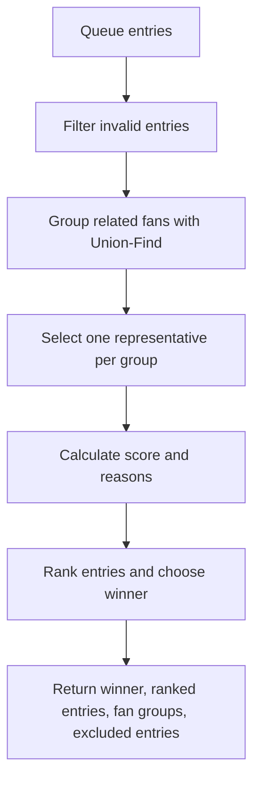

# Front Row Ticket Upgrade Queue

แอป React + TypeScript นี้จำลองระบบคิวอัปเกรดตั๋ว Front Row ให้เป็นธรรมและ deterministic โดยจะกรองรายการที่ไม่ผ่านเกณฑ์ จัดกลุ่มแอคเคาท์ที่เกี่ยวข้องกัน เลือกตัวแทนจากแต่ละกลุ่ม คำนวณคะแนน และเลือกผู้ชนะด้วยกฎที่ชัดเจน

## คำตอบสั้น ๆ ของ challenge

ระบบนี้ใช้ pipeline ต่อไปนี้เพื่อเลือกผู้ชนะ:

1. กรอง entry ที่ถูกยกเลิก / อัปเกรดแล้ว / ถูกบล็อก / เหลือเวลาไม่พอ / มีตั๋วไม่ถูกต้อง
2. ใช้ Union-Find จัดกลุ่ม account ที่เชื่อมโยงกันผ่านหมายเลขโทรศัพท์ Device ID หรือ Payment account
3. เลือก representative จากแต่ละ fan group โดยอิงจากเวลามาเป็นคิวแรกสุด ความภักดีมากสุด และ entry ID น้อยสุด
4. คำนวณคะแนนจากเวลา รางวัล VIP คะแนน loyalty มูลค่าตั๋ว และโหมดเลือก
5. จัดอันดับและเลือกผู้ชนะตามคะแนน แล้วใช้ tie-break ที่ deterministic

## กฎความเป็นธรรมและเงื่อนไข

- รายการที่เป็น cancelled หรือ upgraded จะถูกตัดออกทันที
- รายการที่เลยเวลานัดแสดงสดแล้วจะถูกตัดออกจากคิว
- สมาชิกที่เป็น blocked จะถูกตัดออก
- ตั๋วที่ไม่ถูกต้องหรือเป็น 0 หรือค่าน้อยกว่า 0 จะถูกตัดออก
- บัญชีที่เชื่อมโยงกันจะถูกจัดอยู่ใน fan group เดียวโดยใช้คุณสมบัติ transitive
- หมายเลขโทรศัพท์จะถูก normalize เพื่อให้รูปแบบต่าง ๆ เช่น 081-234-5678 และ 081 234 5678 ถูกนับว่าเป็นข้อมูลเดียวกัน
- กลุ่มที่ใหญ่จะถูกลงโทษเล็กน้อยเพื่อป้องกันการครอบงำคิว

## วิธีคำนวณคะแนน

คะแนนประกอบด้วยปัจจัยดังนี้

- Waiting time: เวลาที่รออยู่ในคิว
- Loyalty points: คะแนนความภักดี
- Ticket value: มูลค่าตั๋ว
- VIP bonus: สมาชิก VIP ได้โบนัสเพิ่มเติม
- Mode-specific adjustments: Rush Hour / VIP Hour / Fair Queue

ค่าคงที่ที่ใช้ในระบบอยู่ใน [src/constants/scoring.ts](src/constants/scoring.ts)

## โหมดให้เลือก

- Standard: ใช้ค่าน้ำหนักปกติ
- Rush Hour: เพิ่มน้ำหนักให้กับการรอคิวนานขึ้น
- VIP Hour: เพิ่มโบนัสให้กับ VIP ในช่วงเวลานั้น
- Fair Queue: ปรับลดคะแนนสำหรับผู้ที่อัปเกรดบ่อย ๆ

## การตัดสิน tie

หากคะแนนเท่ากัน ระบบจะใช้ลำดับต่อไปนี้:

1. รอคิวนานกว่า
2. loyalty points มากกว่า
3. entry ID น้อยกว่า

สิ่งนี้ทำให้ผลลัพธ์ deterministic ตลอด เพราะทุกขั้นตอนของการตัดสินใจมีลำดับชัดเจนและไม่พึ่งพาค่า random หรือการเรียงลำดับที่ไม่แน่นอน

## Future Improvements

- เพิ่มการแก้ไขและปรับแต่งกฎคำนวณคะแนนผ่าน UI เพื่อให้ผู้ใช้ทดลองโหมดต่าง ๆ ได้ง่ายขึ้น
- เพิ่มการแสดงเหตุผลแบบละเอียดมากขึ้นสำหรับแต่ละ fan group และก่อนเลือก winner
- เพิ่มการบันทึกและโหลด queue snapshot เพื่อทดสอบสถานการณ์ต่าง ๆ ได้สะดวกขึ้น
- เพิ่มการรองรับหลายภาษาและการตั้งค่าความเป็นธรรมผ่าน configuration file

## สถาปัตยกรรม



## โครงสร้างโปรเจกต์

- [src/services/buildFrontRowUpgradeQueue.ts](src/services/buildFrontRowUpgradeQueue.ts): orchestrator หลักของ pipeline
- [src/services/filterEntries.ts](src/services/filterEntries.ts): กรองรายการที่ไม่ผ่านเกณฑ์
- [src/services/groupFans.ts](src/services/groupFans.ts): สร้าง fan group ด้วย Union-Find
- [src/services/selectRepresentative.ts](src/services/selectRepresentative.ts): เลือก representative ต่อกลุ่ม
- [src/services/calculateScore.ts](src/services/calculateScore.ts): คำนวณคะแนนและคำอธิบาย
- [src/services/chooseWinner.ts](src/services/chooseWinner.ts): จัดอันดับและเลือกผู้ชนะ
- [src/types/ticket.ts](src/types/ticket.ts): domain model สำหรับ queue entry / fan group / ranked entry / result
- [src/pages/FrontRowUpgradeQueuePage.tsx](src/pages/FrontRowUpgradeQueuePage.tsx): หน้า UI ที่แสดงผลคิวแบบ interactive
- [src/data/sampleData.ts](src/data/sampleData.ts): ข้อมูลตัวอย่างสำหรับแสดงผลทันที
- [src/tests/queueEngine.test.ts](src/tests/queueEngine.test.ts): เทสต์สำหรับพฤติกรรมหลักของ engine

## ความซับซ้อนของอัลกอริทึม

- Filtering: O(n)
- Grouping ด้วย Union-Find: almost O(n)
- Scoring: O(n)
- Sorting ranking: O(n log n)
- Overall: O(n log n)

## วิธีรันบนเครื่องของคุณ

ติดตั้ง dependency:

```bash
npm install
```

รันแอปในโหมด dev:

```bash
npm run dev
```

รันเทสต์:

```bash
npx vitest run
```

สร้าง build สำหรับ production:

```bash
npm run build
```

## ข้อมูลตัวอย่างที่แสดงใน UI

หน้า UI ถูกตั้งค่าให้โหลดข้อมูลตัวอย่างทันทีจาก [src/data/sampleData.ts](src/data/sampleData.ts) เพื่อให้เห็นผลลัพธ์ของคิวโดยไม่ต้องใส่ข้อมูลเอง

ตัวอย่างนี้จะรวมรายการที่ถูกตัดออกและกลุ่มแฟนที่เชื่อมโยงกันไว้ให้เห็นชัดเจน โดยเฉพาะกรณีของการเชื่อมต่อผ่าน phone number / device ID / payment account และการตัดออกจากกฎการแสดงสดที่ผ่านไประบบ

## คำอธิบายสำหรับผู้เล่น

หากกดปุ่มเลื่อนเวลาและเห็นชื่อบางคนหายไป นั่นเป็นผลจากกฎในระบบว่าเมื่อเวลาปัจจุบันเลยเวลานัดแสดงสดของ entry นั้น จะถือว่า entry นั้นไม่ผ่านเกณฑ์และถูกตัดออกจากการคัดเลือกแล้ว

ดังนั้น UI จึงเปลี่ยนแปลงตามเวลาโดยอัตโนมัติ เพื่อแสดงให้เห็นว่าเกิดอะไรขึ้นกับคิวเมื่อเวลาผ่านไป

## การยืนยันผลลัพธ์

โปรเจกต์นี้ถูกตรวจสอบแล้วด้วยผลดังนี้

- เทสต์ผ่าน 9 test case
- Build สำหรับ production สำเร็จ
